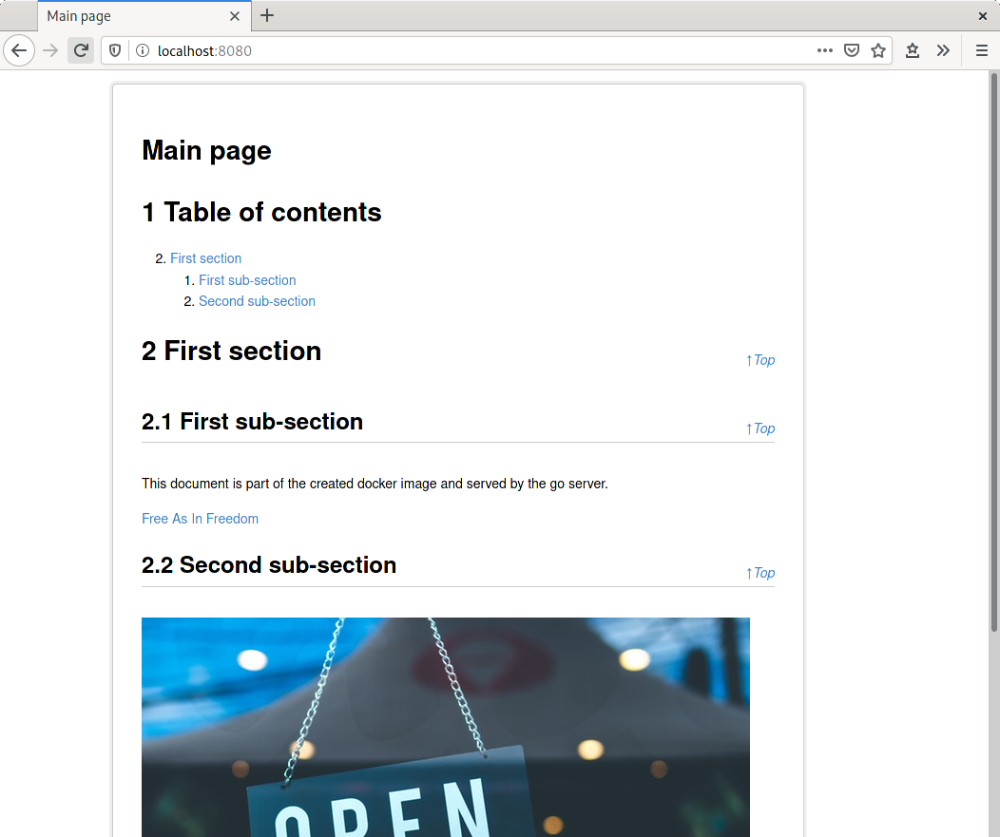

Simon
======

Simple Online Documentation. Generate a HTML page from Markdown and provide it as
a Docker image using a simple server written in go. It is possible to add PDF files
and images to the documentation.



# Requirements

The different build targets require different software to be installed.

* Generation of html requires pandoc
* Generation of pdf requires pandoc and xelatex
* The server, which provides the Wiki as a html page requires go

To install all requirements on Ubuntu run

```bash
$ sudo apt install pandoc texlive-xetex golang
```

# Build

After all requirements are installed the build of the html page can be run
with

```bash
$ make html
```
The pdf document can be build with
with

```bash
$ make pdf
```

To build the server as docker image run

```bash
$ make all
```

# Dun docker image

```bash
docker run -d -p 8080:8080 --name simon simon:1.0.0
```

# Write documentation

Simply edit the markdown file in the public folder, build the docker image and run
a container. The `public` folder contains examples for adding files and images.
